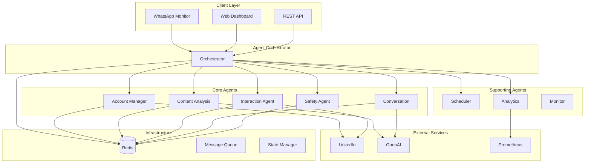

# LinkedIn Multi-Agent Automation System

A sophisticated, enterprise-grade multi-agent system for LinkedIn automation featuring AI-powered decision making, intelligent content analysis, and human-like interactions at scale.

## 🚀 Features

### Core Capabilities
- **Multi-Agent Architecture**: Specialized agents for different aspects of LinkedIn automation
- **AI-Powered Content Analysis**: Advanced NLP for content understanding and relevance scoring
- **Intelligent Interactions**: Human-like engagement patterns with smart timing
- **Account Management**: Secure multi-account handling with session management
- **Safety & Compliance**: Built-in bot detection avoidance and rate limiting
- **Scalable Design**: Kubernetes-ready with horizontal scaling support

### Agent Types

#### Core Agents
- **Account Manager Agent**: Handles LinkedIn authentication, session management, and account rotation
- **Content Analysis Agent**: Analyzes posts for relevance, sentiment, and engagement potential
- **Interaction Agent**: Executes likes, comments, shares with intelligent decision-making
- **Conversation Agent**: Generates organic, context-aware comments and responses
- **Safety Agent**: Monitors for bot detection, rate limiting, and compliance violations

#### Supporting Agents
- **Scheduler Agent**: Manages timing, delays, and interaction scheduling
- **WhatsApp Monitor Agent**: Processes WhatsApp messages for LinkedIn URLs
- **Analytics Agent**: Tracks performance and optimization opportunities

## 🏗️ Architecture



## 🛠️ Installation

### Prerequisites
- Python 3.8+
- Redis
- Docker & Docker Compose (for containerized deployment)
- Kubernetes (for production deployment)

### Local Development Setup

1. **Clone the repository**
```bash
git clone https://github.com/your-org/linkedin-multi-agent-system.git
cd linkedin-multi-agent-system
```

2. **Install dependencies**
```bash
pip install -r requirements.txt
python -m spacy download en_core_web_sm
playwright install chromium
```

3. **Configure the system**
```bash
# Create sample configuration
python src/config/config.py

# Edit configuration
cp config/sample_config.json config/config.json
# Edit config/config.json with your settings
```

4. **Set environment variables**
```bash
export OPENAI_API_KEY="your-openai-api-key"
export REDIS_HOST="localhost"
export REDIS_PORT="6379"
```

5. **Start Redis**
```bash
redis-server
```

6. **Run the system**
```bash
python main.py --config config/config.json
```

### Docker Deployment

1. **Build and start services**
```bash
# Start all services
docker-compose up -d

# Start with monitoring
docker-compose --profile monitoring up -d

# Start specific agents only
docker-compose up -d redis account-manager content-analyzer
```

2. **View logs**
```bash
docker-compose logs -f linkedin-app
```

3. **Scale agents**
```bash
docker-compose up -d --scale content-analyzer=3 --scale interaction-agent=2
```

### Kubernetes Deployment

1. **Create namespace and secrets**
```bash
kubectl apply -f deployment/kubernetes/namespace.yaml

# Create secrets (replace with actual values)
kubectl create secret generic linkedin-secrets \
  --from-literal=openai-api-key="your-openai-api-key" \
  --from-literal=encryption-key="your-encryption-key" \
  -n linkedin-automation
```

2. **Deploy infrastructure**
```bash
kubectl apply -f deployment/kubernetes/configmap.yaml
kubectl apply -f deployment/kubernetes/redis.yaml
```

3. **Deploy agents**
```bash
kubectl apply -f deployment/kubernetes/orchestrator.yaml
kubectl apply -f deployment/kubernetes/agents.yaml
```

4. **Monitor deployment**
```bash
kubectl get pods -n linkedin-automation
kubectl logs -f deployment/linkedin-orchestrator -n linkedin-automation
```

## ⚙️ Configuration

### Basic Configuration

```json
{
  "redis": {
    "host": "localhost",
    "port": 6379,
    "db": 0
  },
  "linkedin": {
    "likes_per_hour": 30,
    "comments_per_hour": 10,
    "business_hours": [9, 18],
    "peak_hours": [10, 11, 14, 15]
  },
  "content_analysis": {
    "target_industries": ["technology", "finance"],
    "target_keywords": ["AI", "innovation"],
    "min_relevance_score": 0.5
  },
  "conversation": {
    "min_confidence_score": 0.7,
    "style": "professional"
  }
}
```

### Environment Variables

| Variable | Description | Default |
|----------|-------------|---------|
| `REDIS_HOST` | Redis hostname | localhost |
| `REDIS_PORT` | Redis port | 6379 |
| `OPENAI_API_KEY` | OpenAI API key | - |
| `LOG_LEVEL` | Logging level | INFO |
| `LINKEDIN_HEADLESS` | Run browser in headless mode | true |

## 🚦 Usage

### Command Line Interface

```bash
# Start all agents
python main.py

# Start specific agents
python main.py --agents account_manager,content_analysis

# Enable debug logging
python main.py --log-level DEBUG

# Start with web dashboard
python main.py --web-dashboard

# Validate configuration
python main.py --dry-run
```

### Adding LinkedIn Accounts

```python
from src.agents.core.account_manager_agent import AccountManagerAgent

# Via API or web dashboard
{
    "email": "user@example.com",
    "password": "secure_password",
    "proxy": {
        "server": "http://proxy:8080",
        "username": "user",
        "password": "pass"
    }
}
```

### Content Analysis

```python
# Analyze content for engagement potential
analysis_request = {
    "content_text": "Great insights on AI innovation...",
    "content_author": "John Doe",
    "content_type": "post",
    "industry": "technology"
}
```

### Interaction Management

```python
# Queue interactions
interaction = {
    "interaction_type": "comment",
    "target_url": "https://linkedin.com/posts/...",
    "comment_text": "Excellent point about AI...",
    "priority": 8
}
```

## 📊 Monitoring

### Health Checks

- **Application Health**: `/health` endpoint
- **Readiness Check**: `/ready` endpoint
- **Agent Status**: Individual agent health monitoring

### Metrics

The system exposes Prometheus metrics for:
- Agent performance and status
- Interaction success rates
- Rate limiting status
- Queue depths
- Error rates

### Dashboards

Access monitoring dashboards:
- **Grafana**: http://localhost:3000 (admin/admin)
- **Prometheus**: http://localhost:9090

## 🔒 Security

### Account Security
- **Encryption**: All passwords encrypted at rest
- **Session Management**: Secure session handling with timeouts
- **Rate Limiting**: Built-in rate limiting per account
- **Proxy Support**: Rotating proxy support for anonymity

### System Security
- **Non-root Containers**: All containers run as non-root
- **Secret Management**: Kubernetes secrets for sensitive data
- **Network Policies**: Restricted inter-service communication
- **Audit Logging**: Comprehensive audit trails

### Compliance
- **LinkedIn ToS**: Built-in compliance monitoring
- **GDPR**: Data protection and retention policies
- **Bot Detection**: Advanced anti-detection measures

## 📈 Scaling

### Horizontal Scaling
- **Agent Pools**: Multiple instances per agent type
- **Load Balancing**: Intelligent task distribution
- **Auto-scaling**: Kubernetes HPA support

### Performance Optimization
- **Caching**: Multi-level caching strategy
- **Connection Pooling**: Efficient database connections
- **Async Operations**: Non-blocking I/O throughout

## 🧪 Testing

### Running Tests

```bash
# Unit tests
pytest tests/unit/

# Integration tests
pytest tests/integration/

# End-to-end tests
pytest tests/e2e/

# With coverage
pytest --cov=src tests/
```

### Test Configuration

```bash
# Set test environment
export TESTING=true
export REDIS_DB=1  # Use separate Redis DB for tests
```

## 🚨 Troubleshooting

### Common Issues

#### Redis Connection Issues
```bash
# Check Redis connectivity
redis-cli ping

# Verify configuration
python -c "from src.config.config import load_config; print(load_config().redis.url)"
```

#### Browser Automation Issues
```bash
# Install browser dependencies
playwright install-deps chromium

# Check browser installation
playwright install chromium --force
```

#### Rate Limiting
```bash
# Check rate limit status
curl http://localhost:8080/api/v1/rate-limits

# Adjust rate limits in configuration
```

### Debugging

```bash
# Enable debug logging
python main.py --log-level DEBUG

# Check agent health
python -c "
import asyncio
from src.infrastructure.health_check import check_agent_health
asyncio.run(check_agent_health('account_manager'))
"
```

### Performance Issues

1. **High Memory Usage**: Reduce agent instances or enable local models
2. **Slow Response Times**: Check Redis performance and network latency
3. **Queue Backlogs**: Scale interaction agents or adjust rate limits

## 🤝 Contributing

### Development Workflow

1. Fork the repository
2. Create a feature branch
3. Implement changes with tests
4. Run linting and tests
5. Submit pull request

### Code Style

```bash
# Format code
black src/ tests/
isort src/ tests/

# Lint code
flake8 src/ tests/
mypy src/
```

### Adding New Agents

1. Create agent class inheriting from `BaseAgent`
2. Implement required abstract methods
3. Add agent configuration
4. Create tests
5. Update documentation

## 📝 License

This project is licensed under the MIT License - see the [LICENSE](LICENSE) file for details.

## ⚠️ Disclaimer

This tool is for educational and automation purposes. Users are responsible for complying with LinkedIn's Terms of Service and applicable laws. The authors are not responsible for any misuse or violations.

## 🆘 Support

- **Documentation**: Check the [docs](docs/) directory
- **Issues**: Open an issue on GitHub
- **Discussions**: Join our community discussions

## 🗺️ Roadmap

- [ ] Advanced AI models integration (GPT-4, Claude)
- [ ] Real-time analytics dashboard
- [ ] Advanced proxy rotation
- [ ] Machine learning for optimization
- [ ] Integration with other social platforms
- [ ] Advanced conversation flows
- [ ] A/B testing framework

---

**Built with ❤️ for LinkedIn automation at scale**